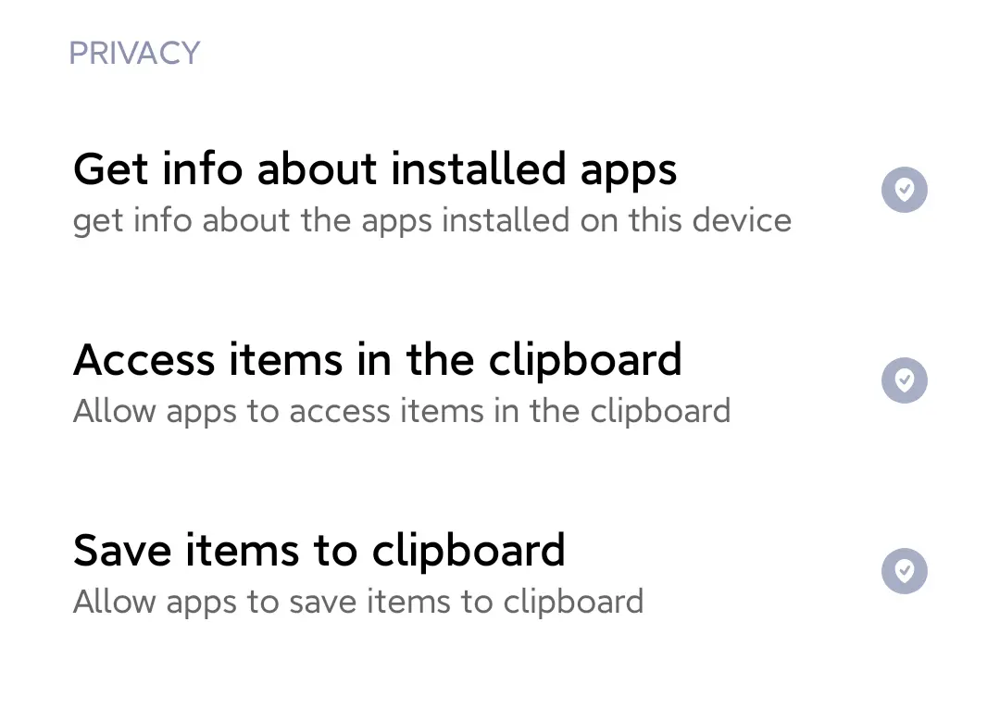
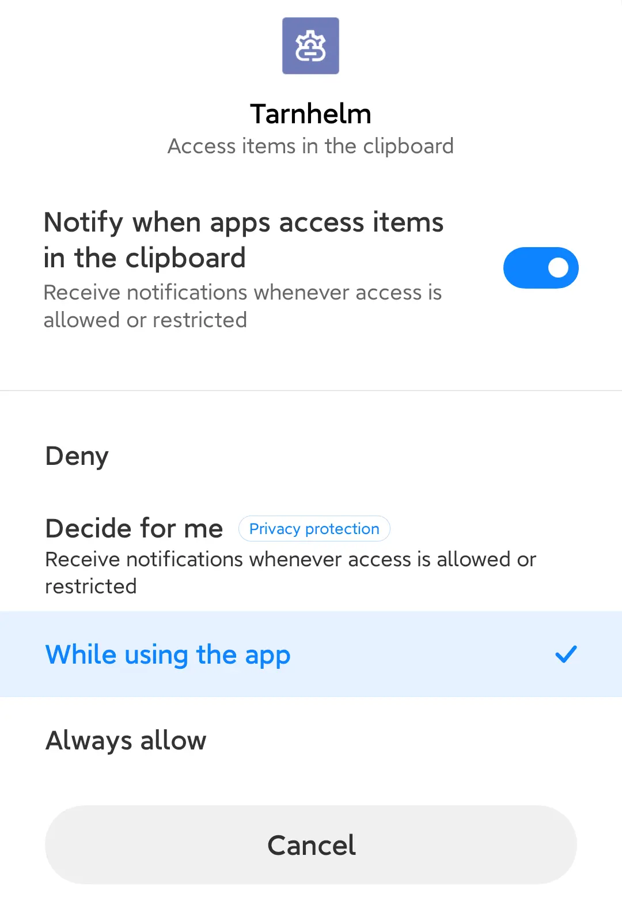
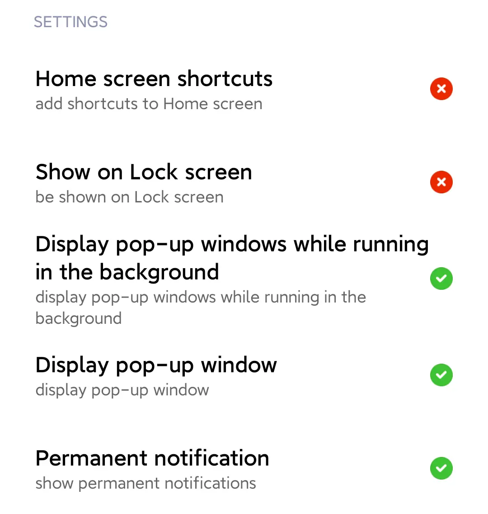

# Enable Background Monitoring on MIUI

After an afternoon of experimentation, we were finally able to figure out how to enable Background Monitoring on MIUI.

## Steps

- Go to "Permissions" - "Privacy" of the app, and set "Access items in the clipboard" and "Save items to clipboard" to "While using the app".

  <p style="text-align: center;">
  
  
  </p>

- Scroll down to "Settings" and set "Display pop-up window" and "Display pop-up windows while running in the background" to "Always allow".

  <p style="text-align: center;">
  
  </p>

- Go to "Notifications" - "Process Result" of the app and turn on "Floating Notifications".

  <p style="text-align: center;">
  
  </p>

- Finally, use ADB to execute the following command:

  ```shell
  adb shell appops set cn.ac.lz233.tarnhelm SYSTEM_ALERT_WINDOW allow
  adb shell pm grant cn.ac.lz233.tarnhelm android.permission.READ_LOGS
  adb shell am force-stop cn.ac.lz233.tarnhelm
  ```
