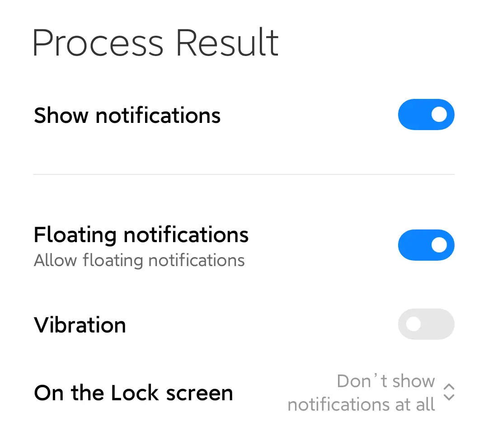

# 在 MIUI 上激活后台监听

经过一个下午与 MIUI 的斗智斗勇之后，我们终于可以知道如何在 MIUI 上激活后台监听。

## 步骤

- 转到应用的「权限」-「隐私」，将「读取剪贴板」和「保存项目到剪贴板」设定为「在使用时允许」。

  <p style="text-align: center;">
  
  
  </p>

- 往下滚动到「设置」，将「显示悬浮窗」和「在后台显示悬浮窗」设定为「永远允许」。

  <p style="text-align: center;">
  
  </p>

- 转到应用的「通知」-「处理结果」，打开「悬浮通知」。

  <p style="text-align: center;">
  
  </p>

- 最后使用 ADB 执行以下命令：

  ```shell
  adb shell appops set cn.ac.lz233.tarnhelm SYSTEM_ALERT_WINDOW allow
  adb shell pm grant cn.ac.lz233.tarnhelm android.permission.READ_LOGS
  adb shell am force-stop cn.ac.lz233.tarnhelm
  ```

## 一些吐槽

如果只想激活后台监听，可以不用看这部分。

MIUI 为了兼容自己以前的屎坑和自己新造的隐私保护轮子，有很多和原生不一致的 API 行为：

- 可以看到  MIUI 的「读取剪贴板」还存在「永远允许」的选项，而从 Android 10 开始，Google 就已经限制了应用通过正常方式在后台读取剪贴板，所以这个选项完全是历史残留，而且经过实际测试，它也没有任何作用。

- 在 MIUI 中使用 ADB 激活 `SYSTEM_ALERT_WINDOW` 后，会发现这只在应用当前的工作阶段生效。这是因为在远古时代 Android 还没有「悬浮窗」权限的概念时，MIUI 造了一个「悬浮窗权限」和「后台显示悬浮窗权限」。先不说分成这两个权限有多蠢（在前台我为什么还要用 Android 给我的悬浮窗？），后来他们也始终没有适配原生的行为，还没有提供 API 供开发者申请权限。
- MIUI 也不遵守「通知渠道」的优先级设定，当应用申请了 `IMPORTANCE_HIGH` 的通知优先级时，原生的行为是默认显示浮动通知，而到了 MIUI 这里，还要经过它所谓的 AI 判断。关键是，这个所谓的 AI 也非常蠢，经过我的测试，在变量相同情况下，重复卸载安装几次 APP，得到的结果都是不一致的。只对国产大厂开了优化（后门）的 AI 麻烦不要随便拿出来好不好。
