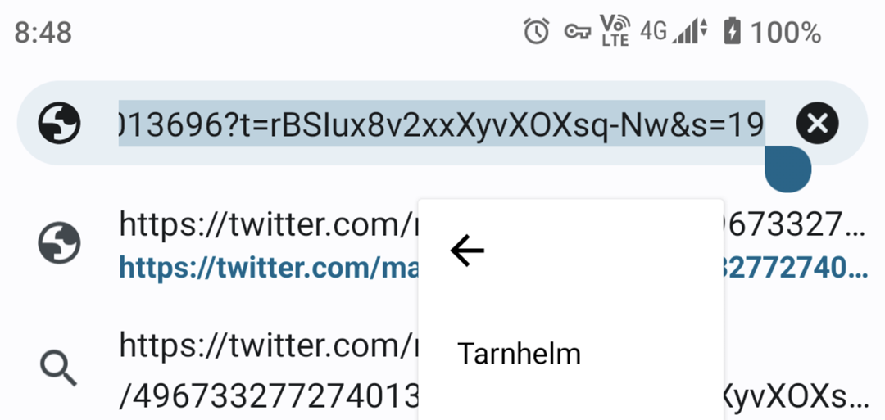
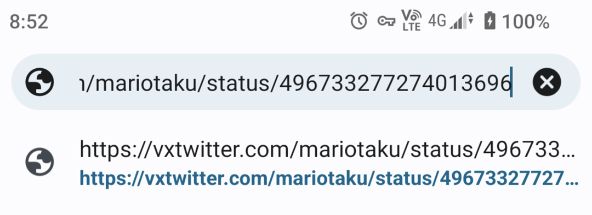
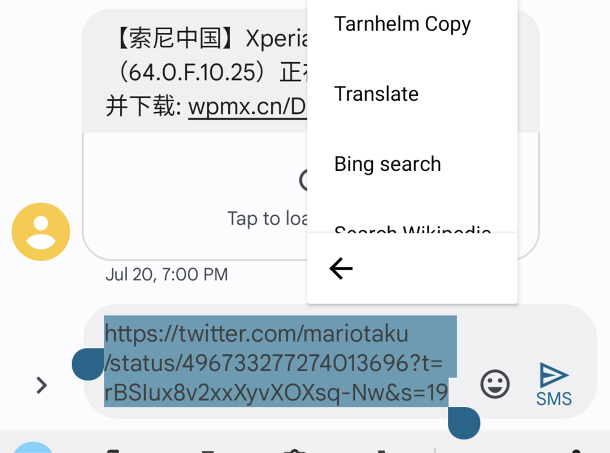
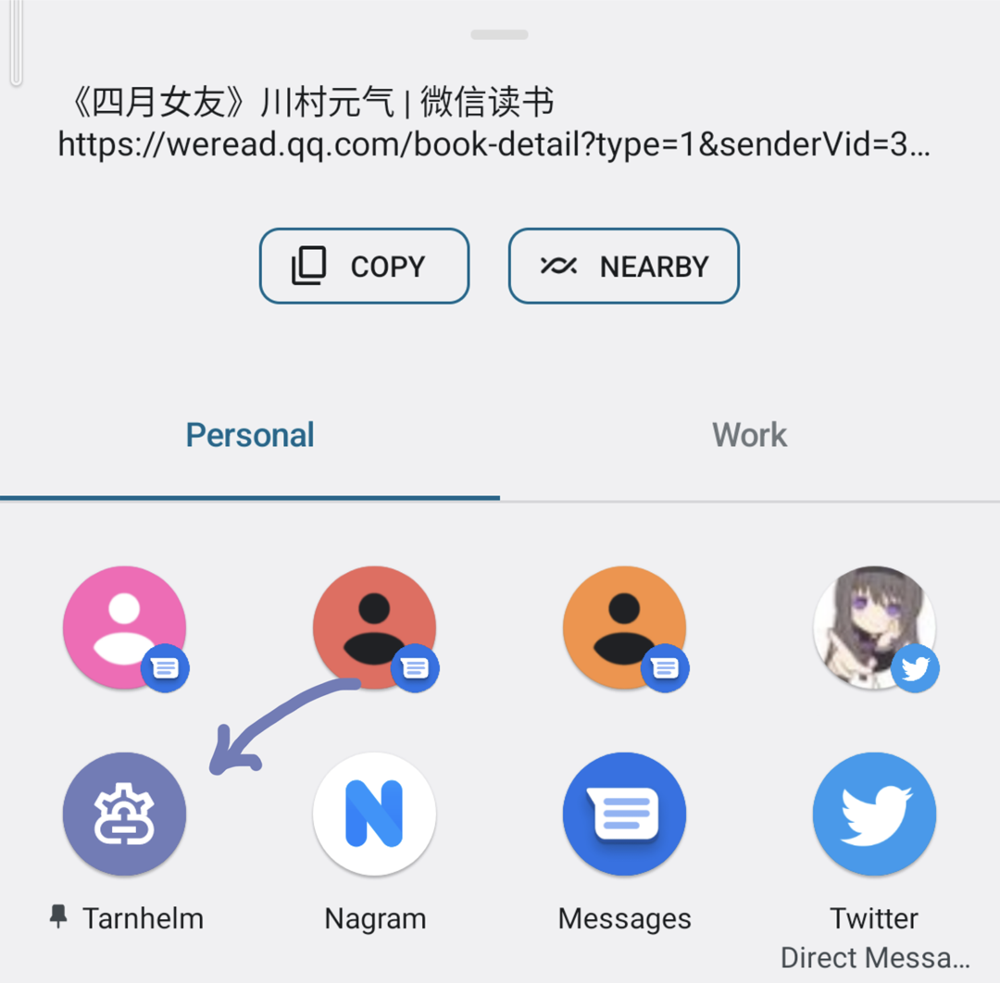
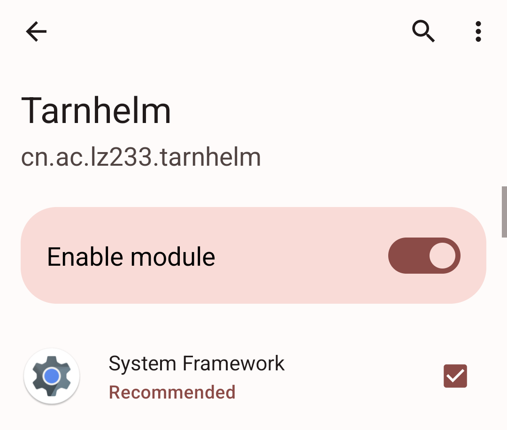

# 简介

Tarnhelm 会帮助你清理应用分享链接中的追踪参数，并尽可能保持这个过程的自然。

Tarnhelm 一词来源于《The Ring of the Nibelung》，参见 [Wikipedia](https://en.wikipedia.org/wiki/Tarnhelm)。

## 编辑菜单模式

在可编辑的文字框内，选中文本并点击「Tarnhelm」即可对链接进行处理。

<p style="text-align: center;">


</p>

## 复制菜单模式

选中链接并点击「Tarnhelm Copy」，可将选中的文本进行处理并加入剪切板。

<p style="text-align: center;">

</p>

## 分享对话框模式

在分享内容时，选中「Tarnhelm」即可对链接进行处理并进行下一步操作。长按应用图标可以将 Tarnhelm 置顶。

<p style="text-align: center;">

</p>

## 后台监听模式

理想情况下，Tarnhelm 会常驻后台监听剪贴板，并对内容进行实时处理。

为了在 Android 10+ 的设备上开启此功能，请使用 ADB 执行以下命令：

```shell
adb -d shell appops set cn.ac.lz233.tarnhelm SYSTEM_ALERT_WINDOW allow
adb -d shell pm grant cn.ac.lz233.tarnhelm android.permission.READ_LOGS
adb shell am force-stop cn.ac.lz233.tarnhelm
```

同时，为了在各类国产 ROM 上允许应用自动开启处理服务，请在「最近任务」界面锁定 Tarnhelm，并转到「安全中心」-「自启动管理」，允许 Tarnhelm 自启动，或在每次开机后手动打开 Tarnhelm 一次。请放心，Tarnhelm 不会在后台进行任何多余的操作。

## Xposed 模式

在管理器中激活 Tarnhelm 并重启，随后在系统每次将内容存入剪贴板的时候，应用都会对内容进行操作。

注意，这个模式与「后台监听」实现的效果是一样的，即都对剪切板进行操作，二选一即可。在有 Xposed 的情况下，我们更推荐此模式。

目前此模式仅支持 LSPosed。

<p style="text-align: center;">

</p>