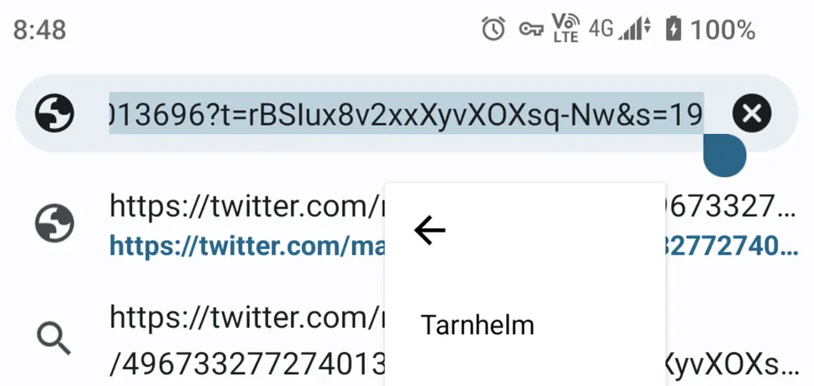
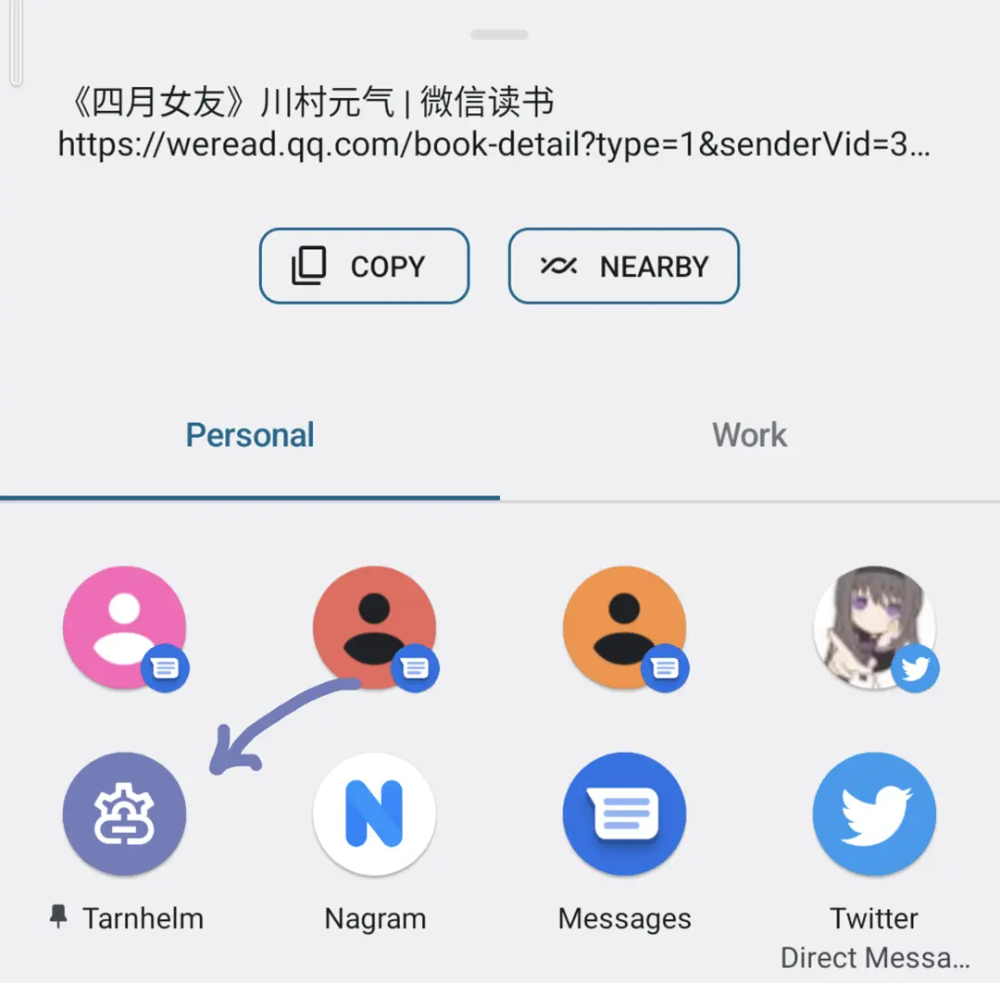
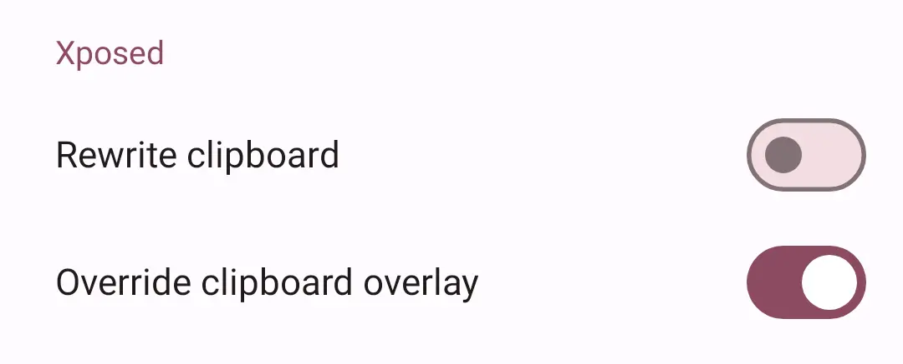
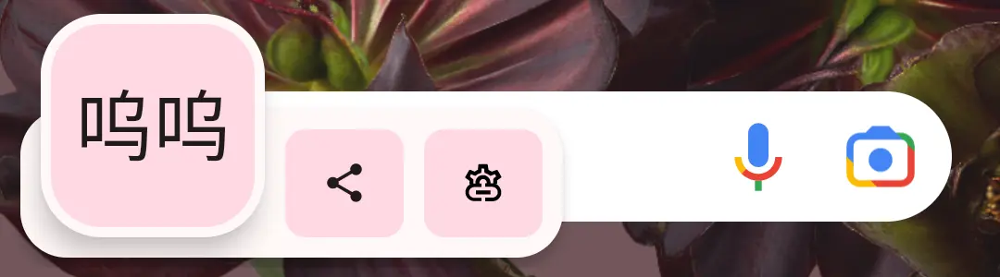

# 简介

Tarnhelm 会帮助你清理应用分享链接中的追踪参数，并尽可能保持这个过程的自然。

Tarnhelm 一词来源于《The Ring of the Nibelung》，参见 [Wikipedia](https://en.wikipedia.org/wiki/Tarnhelm)。

## 编辑菜单模式

在可编辑的文字框内，选中文本并点击「Tarnhelm」即可对链接进行处理。

## 复制菜单模式

选中文本并点击「Tarnhelm Copy」，可将选中的文本进行处理并加入剪切板。

## 分享对话框模式

在分享内容时，选中「Tarnhelm」即可对链接进行处理并进行下一步操作。长按应用图标可以将 Tarnhelm 置顶。

## 后台监听模式

理想情况下，Tarnhelm 会常驻后台监听剪贴板，并对内容进行实时处理。

对于 Android Q 以上的设备，需要使用 [Shizuku](https://shizuku.rikka.app) 进行提权操作，因为系统限制了普通应用在后台读取剪切板的能力。

对于运行国产 ROM 的设备，请自行设置后台保活措施，Tarnhelm 自身不承担保活责任。

「后台监听」与 Xposed 类似，都是一个被动调用的过程，即不会在后台运行任何轮询代码，耗电量应当可以忽略不计。

## Xposed 模式

在 Xposed 管理器中激活 Tarnhelm 并重启，随后可以在应用中找到 Xposed 设置。目前提供两种模式，分别为「重写剪切板」和「覆写剪切板悬浮窗」（Android 13+）。

「重写剪切板」即在应用将文本存入剪切板时对其修改。注意，这个方式与「后台监听」实现的效果是一样的，即都对剪切板进行实时操作，二选一即可。

「覆写剪切板悬浮窗」会在受支持的 Android 13+ 设备的系统剪切板悬浮窗上创建一个新的 chip，点按可对剪切板中的文本进行操作。

目前此模式仅支持 LSPosed。