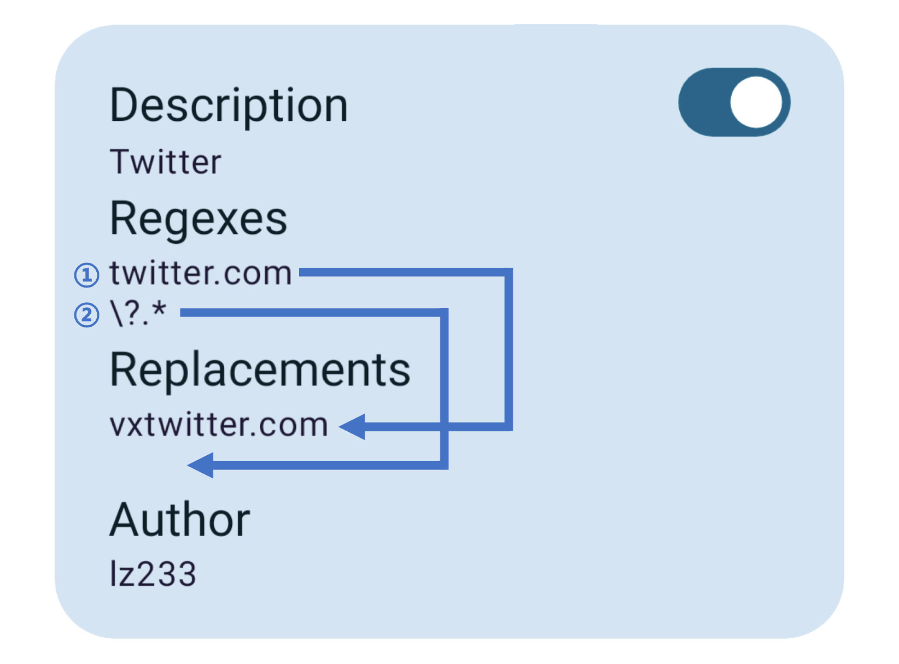

# 指南

这部分指南会引导你理解 Tarnhelm 的处理逻辑，并指导你编写自定义的规则。

## 规则优先级

每条规则会根据列表中的顺序被从上至下逐个处理，且先参数规则先被处理。

长按并拖动某条规则可以对其进行排序。

## 参数规则

参数规则分为「白名单」和「黑名单」两种模式，「白名单」模式保留你在规则中填写的参数名称，「黑名单」模式则会移除它们。

当有多个需要进行操作的参数时，**换行**填写它们。

若需要去除或保留所有参数，可在「参数名称」一栏中**留空**。

每条规则对应一个域名。当有多个需要操作的域名时，请添加**多条**规则。

下面的例子展示了 Tarnhelm 如何利用「参数规则」处理网易云音乐 Android 端的分享链接：

> 0. 示例规则
>
>    eyJhIjoi572R5piT5LqR6Z+z5LmQIiwiZSI6InkubXVzaWMuMTYzLmNvbSIsImYiOjAsImciOlsiaWQiXSwiZCI6Imx6MjMzIn0=
>
> 1. 接收到文本
>
>    分享46_P/诗岸的单曲《Narcissus》: https://y.music.163.com/m/song?id=1835695995&userid=299866209&dlt=0846 (来自@网易云音乐)
>
> 2. 根据内置正则表达式从中提取出链接
>
>    https://y.music.163.com/m/song?id=1835695995&userid=299866209&dlt=0846
>
> 3. 根据规则中的「白名单」模式和「参数名称」中的 `id`，保留这个参数
>
>    https://y.music.163.com/m/song?id=1835695995

## 正则规则

正则规则中的「正则」和「替换内容」按行对应，并按从上至下的顺序被处理，如下所示。

首行正则带有特殊性，起到匹配作用，如果首行正则匹配不到链接中的任一字符，则 Tarnhelm 会**跳过**整条规则。利用这个特性，我们可以限定正则规则的作用范围。

「替换内容」会将链接中匹配到的**所有**部分进行替换，如 `https://coolapk.com/apk/com.coolapk.market` 中的两个 `coolapk` 都被匹配之后，会被全部替换。

下面的例子展示了 Tarnhelm 如何利用「正则规则」处理酷安 Android 端的分享链接：

> 0. 示例规则
>
>       eyJhIjoi6YW35a6JIiwiYiI6WyJjb29sYXBrLmNvbSIsIlxcPy4qIl0sImMiOlsiY29vbGFwazFzLmNvbSIsIiJdLCJkIjoibHoyMzMifQ==
>
> 1. 接收到文本
>
>    分享酷安用户@羽韵Linus 的图文：【『超长文+多图警告』Google Glass体验报告】 https://www.coolapk.com/feed/14640271?shareKey=ZjczNTkxZDBmMTU4NjJlYTU3MTU~&shareUid=12202&shareFrom=com.coolapk.market_12.4 分享自【酷安App】
>
> 2. 根据内置正则表达式从中提取出链接
>
>     https://www.coolapk.com/feed/14640271?shareKey=ZjczNTkxZDBmMTU4NjJlYTU3MTU~&shareUid=12202&shareFrom=com.coolapk.market_12.4
>
> 3. 根据规则中的第一条正则 `coolapk.com` 找到匹配并替换为 `coolapk1s.com`
>
>     https://www.coolapk1s.com/feed/14640271?shareKey=ZjczNTkxZDBmMTU4NjJlYTU3MTU~&shareUid=12202&shareFrom=com.coolapk.market_12.4
>
> 4. 根据规则中的第二条正则 `\?.*` 匹配所有参数并替换为空字符串
>
>     https://www.coolapk1s.com/feed/14640271